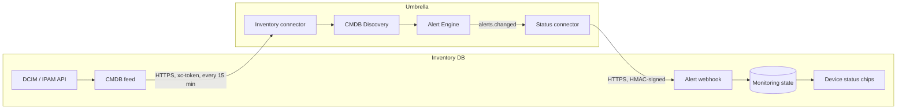

# Integration with Umbrella monitoring

[Umbrella](https://github.com/sbrw-evc/Umbrella-Monitoring) is the umbrella monitoring app: it collects
events from every monitoring system, deduplicates them into alerts, builds a CMDB map and pages through
PagerDuty. Inventory DB and Umbrella work together in two directions:

| Direction | What | How |
|---|---|---|
| Inventory DB → Umbrella | Sites, racks and devices become configuration items (CIs) of Umbrella's CMDB map, with names, IPs, DNS names and serials to match events against, and `located_in` / `connected_to` relations for impact analysis | Umbrella's inventory connector pulls `GET /api/v1/integrations/:id/umbrella/ci` every 15 minutes with an API token (flow П-06 in Umbrella's docs) |
| Umbrella → Inventory DB | Alert state on each device: worst open severity, alert titles, links to the Umbrella incident and its Grafana dashboard | Umbrella POSTs alert changes to `POST /api/v1/integrations/:id/umbrella/alerts`, signed with the integration secret |



## Set up

1. In Inventory DB create an integration: `POST /api/v1/integrations`
   `{"kind":"umbrella","title":"Umbrella prod","umbrellaUrl":"https://umbrella.corp","inventoryUrl":"https://inventory.corp"}`.
   Save the returned `secret`; it is shown once (`POST /integrations/:id/rotate-secret` issues a new one).
   The **Integrations** page in the web UI does the same and shows the feed and webhook URLs to paste into Umbrella,
   the time of the last full feed read and of the last signed alert, and alerts that matched no device.
2. Create an API token for a read-only service user (`POST /api/v1/tokens`). The feed contains what
   that user can read through the DCIM/IPAM API.
3. In Umbrella, put the token and the secret into OpenBao and build two connectors in the low-code
   builder (step-by-step in Umbrella's `integrations/inventory-db.md`):
   - **Inventory connector**: schedule trigger 15 min → HTTP REST `GET {inventory}/api/v1/integrations/{id}/umbrella/ci`
     with header `xc-token`, paging by `offset` until `next_offset` is null → output "inventory object".
     Mark Inventory DB as a trusted discovery source so additions apply without review.
   - **Status connector**: subscription to `alerts.changed`, filter "CI has a `inventory-db:` source_ref,
     or is a host", HTTP REST `POST {inventory}/api/v1/integrations/{id}/umbrella/alerts` with the
     signature headers below.

## CMDB feed

`GET /api/v1/integrations/:id/umbrella/ci?offset=0&limit=1000` returns a full snapshot; Umbrella's CMDB
Discovery compares consecutive snapshots, so deletions show up as removals for review there.

```json
{
  "source": "inventory-db", "integration_id": "int_…", "generated_at": "2026-10-08T14:00:00.000Z",
  "count": 4, "offset": 0, "next_offset": null,
  "items": [{
    "source_ref": "inventory-db:dcim.device:100",
    "type": "device", "name": "App-01", "status": "active", "monitored": true,
    "identities": { "hostname": "app-01", "fqdn": ["app-01.corp.example"], "ip": ["10.0.0.5"], "serial": "SN100" },
    "logical_group": null,
    "attributes": { "role": "Server", "manufacturer": "Dell", "model": "R650", "site": "DC1", "rack": "R01", "tags": ["prod"] },
    "relations": [
      { "type": "located_in", "direction": "out", "target_ref": "inventory-db:dcim.rack:10" },
      { "type": "connected_to", "direction": "out", "target_ref": "inventory-db:dcim.device:101", "via": "cable 5" }
    ],
    "url": "https://inventory.corp/dcim/devices/100",
    "last_updated": "2026-10-01T10:00:00Z"
  }]
}
```

- `source_ref` is stable; Umbrella keeps it in the CI's `source_refs` and sends it back with alerts.
- `monitored` is false for `planned`, `offline`, `inventory` and `decommissioning` objects so Umbrella can
  suppress paging for them.
- `logical_group` is the virtual chassis or cluster, used by Umbrella to glue members together.
- IPs come from IPAM addresses assigned to the device's interfaces plus its primary and OOB IPs; FQDNs
  from the addresses' DNS names.

## Alert webhook

`POST /api/v1/integrations/:id/umbrella/alerts`, body is one event or an array of up to 500:

```json
{
  "alert_id": "8f1c…", "status": "open", "severity": "critical",
  "title": "Host down: app-01", "signal": "use.host.availability",
  "ci": { "source_refs": ["inventory-db:dcim.device:100"], "name": "app-01",
          "identities": { "hostname": "app-01", "fqdn": "app-01.corp.example", "ip": "10.0.0.5" } },
  "links": { "incident": "https://umbrella.corp/incidents/8f1c…", "grafana": "https://umbrella.corp/go/incidents/8f1c…/grafana" },
  "updated_at": "2026-10-08T14:00:00Z"
}
```

- `status`: `open`, `acknowledged`, `resolved`, `closed`; `severity`: `critical`, `error`, `warning`, `info`.
- **Signature.** `x-umbrella-timestamp: <unix seconds>` and
  `x-umbrella-signature: v1=<hex HMAC-SHA256(secret, "<timestamp>.<raw body>")>`. Requests older than
  5 minutes are rejected. During rotation the header may carry two comma-separated signatures.
- **Matching.** An `inventory-db:` source_ref wins. Otherwise the CI's hostname, FQDN (and its short
  name), name and IPs are matched case-insensitively against devices. Alerts that match nothing are
  listed at `GET /integrations/:id/umbrella/unmatched`.
- **Ordering.** Updates are idempotent by `alert_id`; an update with an older `updated_at` than the stored
  one is ignored, so retries and out-of-order deliveries are safe. Resolved alerts are kept 30 days.

## Showing status

`GET /api/v1/integrations/umbrella/status?object_type=dcim.device&ids=100,101` returns, for each id, the
`state` (`ok`, `info`, `warning`, `error`, `critical`) and the active alerts, worst first.
`GET /api/v1/integrations/umbrella/status/dcim.device/100` adds the last 50 alerts as `history`. Device
lists show `state` as a status chip using the design tokens (`--critical-*`, `--error-*`, …), and the
device side panel lists the alerts with links to the incident and its Grafana dashboard.

## Security
- The signing secret is stored encrypted (AES-256-GCM) under `INTEGRATION_KEY` (falls back to `JWT_SECRET`).
- The webhook answers 401 for unknown, inactive and badly signed requests alike, so ids can't be probed.
- Matching by hostname/IP reads the inventory as the integration's creator, cached for 60 seconds.
